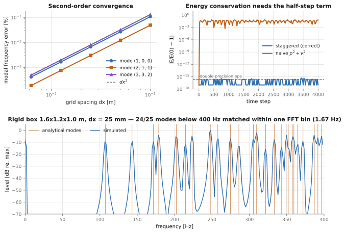
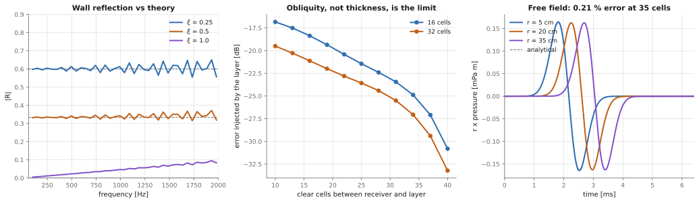
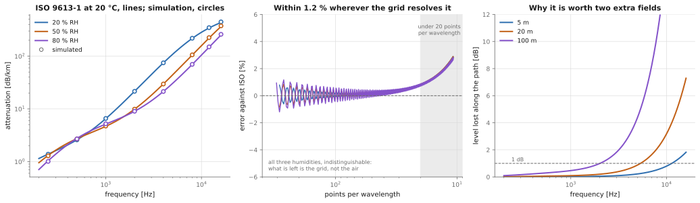
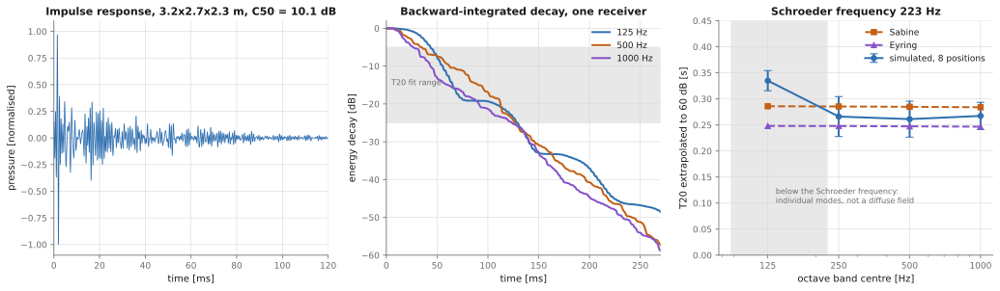

# Progress log

Newest last. Each entry records what was measured, under what conditions, and what it means.

---

## M0 — Scaffold

Repository laid out to match the companion `plate-fdtd` project: `src/` layout with uv,
ruff + pytest under GitHub Actions, `PLAN.md` / `PROGRESS.md`, figures as SVG in
`docs/figures/`.

`commit.sh` is deliberately untracked. It bypasses the unreadable global git config, sets the
identity per-repo, and stops at the local commit — pushing happens outside the sandbox. It also
refuses to commit if `tmp/` ever becomes tracked: that directory holds the 2D prototype this
work grew out of, the repository is public, and a guard is worth more than a comment.

---

## M1 — The lossless core

Staggered pressure–velocity leapfrog in 3D, rigid walls, NumPy, double precision.

### Design decisions

**The stored state is always `(p^n, v^{n-1/2})`.** Every diagnostic is written for that
pairing. This is the decision the whole module rests on: mixing the two fields without naming
an instant costs O(dt) in anything derived from both, and O(dt) errors do not announce
themselves.

**Rigid walls are structural, not a boundary routine.** The velocity planes lying on the walls
are never written to, so they hold the zero they were allocated with. Fastest, least fragile,
and it is what makes the energy identity exact rather than approximate.

**The time step comes from the Courant condition.** The 2D prototype used
`dt = 1e-2 / (1.2 * f_max)`, which is stable only because its `dx = 1e-2` was baked into the
numerator; changing the spacing there would have produced an unstable run with no warning.
Here `dt = C * dx / (c sqrt(3))` with `C = 1` by default — the stability limit, which is also
the point of minimum numerical dispersion.

**The simulated room is reported, not the requested one.** One uniform spacing cannot divide
three arbitrary lengths, so each axis rounds to whole cells. The half-cell difference shifts
the modal frequencies by about as much as the discretisation error being measured, so
`Grid.lengths` gives what is actually simulated and `Grid.length_error` gives the gap.

### Results



**Energy conservation.** Rigid box 0.8 x 0.65 x 0.55 m, `dx = 50 mm`:

| initial condition | Courant | steps | relative energy drift |
| --- | --- | --- | --- |
| three exact modes | 1.0 | 4000 | `4.4e-16` |
| broadband noise | 1.0 | 2000 | `6.2e-16` |
| broadband noise | 0.9 | 2000 | `0.0` (exactly) |

This is round-off, i.e. the identity holds. The same run scored with the naive `p^2 + v^2`
energy — the one that ignores the half step — oscillates at `7.7e-2`. That form is not a
slightly worse diagnostic; it is not conserved at all, its error scaling as `omega dt / 2`,
which is a fraction of a percent for a well-resolved low mode and order one for content near
the grid limit. It cannot be used to detect bugs, which is what the correct one is for.

**A single mode stays a single mode.** The cosine mode shapes are exact eigenvectors of the
*discrete* rigid-wall operator, so with a consistently staggered initial velocity
(`v^{-1/2} = (dt / 2 rho) grad p^0`, not zero) the field must stay exactly
`cos(omega n dt) * Phi` forever. Over 3000 steps, mode (2,1,1), `dx = 40 mm`:

- max absolute error `1.3e-13` at unit amplitude.

This is the strongest single test here: a sign error, a slice off-by-one, a mistimed boundary
or a wrong half-step initialisation each detune the oscillation or leak energy into other
modes, and both are visible far above that tolerance.

**Convergence to the analytical frequencies.** Room 1.6 x 1.2 x 1.0 m, mode (2,1,1):

| dx [m] | points per wavelength | relative error |
| --- | --- | --- |
| 0.100 | 11 | `4.93e-4` |
| 0.050 | 22 | `1.23e-4` |
| 0.025 | 44 | `3.06e-5` |
| 0.0125 | 89 | `7.65e-6` |
| 0.00625 | 177 | `1.91e-6` |

Ratio 4.0 per halving — second order, as it should be. Note this is the *scheme's* frequency
from its dispersion relation against the continuous one; it is the discretisation error alone,
with no simulation noise in it.

**Broadband run.** Room 1.6 x 1.2 x 1.0 m, `dx = 25 mm` (64 x 48 x 40 cells), `dt = 42.05 us`,
0.6 s simulated, Gaussian pulse source, single pressure probe, both at asymmetric points:

- 25 analytical modes below 400 Hz, **24 matched within one FFT bin** (1.67 Hz)
- median offset between an analytical mode and the nearest interpolated peak: **0.080 Hz**

The one miss is not a discrepancy: that mode has a node at the source or the probe, so it is
not excited and its "nearest peak" belongs to a neighbour.

### Baseline throughput (NumPy, fp64)

Single-threaded NumPy on the M2 Ultra, for reference before the fast backends exist:

| grid | cells | cell-updates/s |
| --- | --- | --- |
| 32³ | 0.03 M | 173 M |
| 64³ | 0.26 M | 234 M |
| 96³ | 0.88 M | 214 M |

What that means in practice: one second of impulse response in a 5 x 4 x 3 m room at 1 kHz
(`dx = 34 mm`, 1.5 M cells, 17 000 steps) is about **2 minutes** at this rate, and the cost
scales as `f_max^4` — three spatial dimensions and the time step together. At 4 kHz the same
room is roughly 8 hours. That is the whole argument for M5–M7.

### Next

M2: boundaries. Rigid is the only wall condition so far, which also means the energy test
currently covers the easiest case there is — the passivity of the impedance and PML
formulations is the next thing that needs proving rather than assuming.

---

## M2 — Boundaries

Locally reacting absorbing walls, a graded absorbing layer for free field, and the free-field
Green's function as the check that ties propagation, source calibration and boundaries
together.

### Design decisions

**The wall condition is centred in time, and therefore implicit — but only within one cell.**
Imposing `v = Y p` directly means setting `v^{n+1/2}` from `p^n`, which is off by `dt/2`; the
sign of that error decides whether the wall quietly gains or loses energy, and it is the usual
reason FDTD boundaries go unstable. Centring it, `v^{n+1/2} = Y (p^{n+1} + p^n) / 2`, is
implicit in `p^{n+1}` — but the coupling is local, so it solves in closed form:

```
p^{n+1} = ((1 - a) p^n - rho c^2 dt div_interior) / (1 + a),     a = c dt xi / (2 dx)
```

Each absorbing face touching a cell adds its own `a`, so edges and corners need no special
case: the coefficients simply sum. This form can only remove energy, for any `xi >= 0`.

**The wall velocity planes stay at zero.** The flux through a wall enters through the
coefficient above and nowhere else. Storing a wall velocity as well would double-count it on
the next step — the kind of bug that halves an absorption coefficient and looks like a
modelling disagreement.

**The absorbing layer damps both equations by the same sigma.** That leaves the local impedance
at `rho c` everywhere, including where sigma varies. It is separable per axis, so it costs
three 1D profiles, no extra field, and is applied only to the slabs where it differs from one.

### Results



**Absorbing walls, normal incidence.** Pulse down a one-cell duct, gated into incident and
reflected arrivals, mean over 60 Hz – 2 kHz:

| xi | measured \|R\| | theory `(1-xi)/(1+xi)` |
| --- | --- | --- |
| 0 (rigid) | 0.9998 | 1 |
| 0.25 | 0.6026 | 0.6 |
| 0.5 | 0.3384 | 0.3333 |
| 1 (matched) | 0.0477 | 0 |

The rigid row is the measurement's own accuracy — 0.02 % — so the two middle rows agree with
theory to within about half a percent of the incident amplitude.

The matched wall is the interesting one. It is exact at DC and degrades with frequency,
reaching `|R| = 0.09` at 2 kHz, which is 17 points per wavelength on this grid. Nothing is
wrong with the boundary: the *discrete* wave impedance is not exactly `rho c` once the grid
starts to disperse, so matching the continuous impedance stops being a match. That is a
property of first-order absorbing conditions in general, and it is the reason free-field runs
get a layer instead.

**The absorbing layer.** At normal incidence the layer is not approximately transparent but
exactly so: with the same sigma on both equations the two characteristics decouple, so a
right-going wave stays right-going whatever sigma does — grading included. Measured in the
duct, over the same band:

| layer depth | worst reflection in band |
| --- | --- |
| 8 cells | −86 dB |
| 16 cells | −108 dB |
| 32 cells | −111 dB |

Which is why the useful measurement is a 3D one. Running the same monopole problem twice — once
in a domain lined with the layer, once in a domain large enough that its own walls cannot answer
within the window — isolates exactly what the layer contributes:

| clear cells between receiver and layer | 16-cell layer | 32-cell layer |
| --- | --- | --- |
| 10 | −16.8 dB | −19.5 dB |
| 40 | −30.8 dB | −33.2 dB |

Doubling the layer buys 3 dB; moving the receiver 30 cells further from it buys 14. **The limit
is obliquity, not thickness** — a matched layer is matched at normal incidence only, and a
spherical wave hits it at every angle. If a job needs better than about −30 dB, the answer is a
true PML with coordinate stretching, not a thicker sponge. That is now a measured argument
rather than a guess, and −30 dB is the number it has to beat.

**Free field against the analytical Green's function.** Monopole at the centre, compared to
`p = rho Q'(t - r/c) / (4 pi r)` with `Q = q dx^3`:

| points per wavelength | r = 5 cells | r = 20 cells | r = 35 cells |
| --- | --- | --- | --- |
| 10.4 | 8.5 % | 30.9 % | 47.6 % |
| 28.6 | 2.1 % | 1.2 % | 2.4 % |
| 60.8 | 1.4 % | 0.21 % | 0.21 % |

At 61 points per wavelength the simulation and the closed-form solution agree to two parts in a
thousand, which also pins the source calibration: a mis-scaled volume source would show up as a
constant offset at every radius, and there is none to two decimal places. The residual at
5 cells is the near field of a source that is a cube rather than a point, and it does not
improve with resolution in the way the far field does.

The top row is the dispersion error growing with propagation distance, and it is the strongest
argument in this log for measuring the required resolution rather than assuming ten points per
wavelength: at 10 points, a pulse is 48 % wrong after 35 cells of travel.

### Two bugs this milestone found

**Cell indexing.** `1.2 / 0.01` is `119.99999999999999`, so a plain floor put a point on a cell
boundary one cell low — while `0.5 / 0.01` is exact and did not. Two grids of the same spacing
disagreed by one cell about where the same point was, which surfaced as a 7 % amplitude error
in the free-field comparison and looked like physics. `Grid.cell_index` now snaps within a
millionth of a cell.

**Comparing at a radius nothing was measured at.** A probe snaps to the cell containing it, so
a receiver asked for at 17.5 cells is measured at 17 — and comparing it against the analytical
solution at 17.5 costs a 7 % error that has nothing to do with the solver. Separations are now
read back from the indices rather than from the request.

Neither was caught by a test. Both were caught by comparing against a closed-form answer, which
is the argument for having one.

---

## M3 — Air absorption

ISO 9613-1 attenuation, as a property of the simulated medium rather than a post-processing
filter.

### Design decisions

**No fitting step.** The ISO formula is a sum of a classical `f^2` term and two relaxation
terms of the form `C f^2 F / (F^2 + f^2)`. A relaxing fluid with one auxiliary field per
process has exactly that attenuation:

```
dp/dt = -rho c_inf^2 div v + sum_nu psi_nu
tau_nu dpsi_nu/dt + psi_nu = rho c_0^2 Delta_nu div v

  =>  alpha_nu(f) = (pi Delta_nu / c) f^2 F_nu / (F_nu^2 + f^2)
```

so the strengths follow by matching coefficients: `Delta_nu = C_nu c / pi`, with `C_nu` read
straight out of the standard. There is no curve fit and no free parameter. Cost is two extra
cell-sized fields and about ten flops per cell.

**The classical term's relaxation frequency is the Nyquist frequency of `dt`.** An `f^2` law is
a relaxation with `F` at infinity, which a grid cannot have. Placing it at Nyquist makes the
term indistinguishable from `f^2` across the resolved band and roll off above it instead of
growing — the right way to be wrong in a band the scheme cannot represent anyway.

**The relaxation states are integrated exactly, not by a difference formula.** The oxygen
process has `tau` of a few microseconds, which is *shorter than `dt`* on any ordinary grid. The
trapezoidal rule is stable there but rings at Nyquist; the exponential form
`psi <- e^{-dt/tau} psi + (1 - e^{-dt/tau}) G` is exact in that limit and simply pins the state
to its target. The pressure update takes the exact mean of that solution over the step rather
than the endpoint average, which costs one precomputed constant and removes a half-step lag.

**`Medium.sound_speed` is the unrelaxed speed.** Relaxation makes sound speed frequency
dependent — here by 0.05 % between the low- and high-frequency limits. The time step is derived
from the fast one, so reading it as the low-frequency speed would make the Courant number
0.05 % larger than requested, which at the stability limit is not a rounding difference.

### Results



A pulse down a 20 m duct at `dx = 2 mm`, recorded 16 m apart and differenced. The measurement
works because dispersion changes a spectrum's phase and not its magnitude, so the ratio of two
magnitude spectra sees the attenuation alone.

Measured attenuation against the standard, dB/km at 20 °C:

| f [Hz] | 20 % RH | | 50 % RH | | 80 % RH | |
| --- | --- | --- | --- | --- | --- | --- |
| | measured | ISO | measured | ISO | measured | ISO |
| 1000 | 6.59 | 6.53 | 4.72 | 4.66 | 5.22 | 5.15 |
| 2000 | 21.52 | 21.55 | 9.89 | 9.89 | 9.02 | 9.00 |
| 4000 | 74.76 | 74.71 | 29.64 | 29.67 | 21.38 | 21.41 |
| 8000 | 218.44 | 217.13 | 105.83 | 105.29 | 69.81 | 69.49 |
| 16000 | 446.97 | 434.54 | 375.31 | 364.54 | 259.52 | 252.17 |

**Within 1.2 % of ISO 9613-1 wherever the grid gives at least 20 points per wavelength**, and
within 3 % down to 11. Note that the three humidities span a factor of three in attenuation at
8 kHz and the model tracks all of them — matching the *dependence* is a much stronger claim
than matching one curve, and the humidity dependence is where a hand-tuned damping constant
would come apart.

The residual error is independent of humidity, which is the tell that what is left is the grid
rather than the air.

### What it is worth, stated plainly

At 20 °C and 50 % RH, air absorption reaches 1 dB after 12 m at 8 kHz, 5 m at 12 kHz, and
100 m at 2 kHz. So for a room it is a top-octave effect on the late decay, and for anything
outdoors or in a large hall it is not optional.

It is **not** a stability mechanism, and it was never expected to be. Nothing about these
numbers rescues a run that would otherwise diverge; stability comes from the Courant condition
and from passive boundaries. What absorption buys is a physically correct high-frequency decay
slope and a bound on accumulated high-frequency numerical energy.

### Next

M4: sources, receivers, impulse-response export and the room-acoustics metrics — the first
milestone whose output is a file someone can listen to.

---

## M4 — Impulse responses and room acoustics

Excitation, receivers, deconvolution, wav export, and the standard parameters — plus rung 4 of
the validation ladder, which is the first one whose reference is not exact.

### Design decisions

**Band-limited excitation, then deconvolution.** A unit impulse is flat to Nyquist, and the top
of that range is where the grid is worst — a response excited that way is not visibly wrong, it
just has a smeared top end with nothing in the output to say so. The excitation is a windowed
sinc flat to a stated `max_frequency`, divided back out afterwards, and the response is exactly
zero above that limit because above it the grid was not asked to be right.

**No swept sines.** Sweeps exist to buy signal-to-noise ratio against background noise and to
push distortion out of the measurement window. A simulation is silent between arrivals and
exactly linear, so a sweep would be ceremony at several times the run length.

**Schroeder integration runs to the end of the response.** Real analysis needs a truncation
point because the tail of a measurement is noise, not decay. A simulated response decays into
round-off, so the integration is exact and none of that machinery is needed. The absence is a
property of the input, not a simplification.

### Results



Room 3.2 x 2.7 x 2.3 m (19.9 m³), walls at 0.15 normal-incidence absorption, 20 °C / 50 % RH,
grid 108 x 91 x 78 at 29.6 mm, 2 sources x 4 receivers:

| octave band | simulated T20 | Sabine | Eyring | vs Eyring |
| --- | --- | --- | --- | --- |
| 125 Hz | 0.335 ± 0.019 s | 0.286 | 0.248 | **+35 %** |
| 250 Hz | 0.266 ± 0.038 s | 0.285 | 0.248 | +7.4 % |
| 500 Hz | 0.261 ± 0.035 s | 0.285 | 0.247 | +5.6 % |
| 1000 Hz | 0.267 ± 0.026 s | 0.284 | 0.247 | +8.4 % |

Above the Schroeder frequency (223 Hz) the simulation sits between Eyring and Sabine, nearer
Eyring, within 6–8 %. That is as close as statistical theory gets to a real room, and closer
than the spread between source-receiver positions in a measurement.

The 125 Hz band is 35 % away, and **that is the correct answer**. The Schroeder frequency is
223 Hz; below it a room is a handful of separately decaying modes rather than a diffuse field,
and Sabine's derivation does not apply. The small spread across the eight positions (± 0.019 s)
confirms it is a property of the room and not measurement scatter. Agreement in that band would
have meant the simulation was reproducing the formula rather than the physics.

### The trap that cost the most here

**The absorption coefficient in Sabine's formula is the random-incidence one, and a wall
admittance is defined at normal incidence.** A locally reacting surface absorbs considerably
more obliquely than head-on: a wall quoted at 0.15 normal-incidence is 0.252 averaged over
angle, and the predicted reverberation time differs by a factor of 1.7. The first run of this
comparison showed a "measured" T60 of half the predicted value and looked like a serious bug in
the boundaries. The boundaries were right; the comparison was wrong. `Room.diffuse_absorption`
now does the Paris integral, and `Room.sabine_reverberation_time` uses it.

A second, smaller one: decay rates are measured on the **raw recording**, not the deconvolved
response. Deconvolution leaves a broadband residue where the excitation had little energy; that
residue never decays, so the backward integral flattens onto it and a T30 fit reports the noise
floor as a reverberation time — 5.1 s in the first attempt. The excitation is a few
milliseconds long, so using the raw recording costs only the first few milliseconds of the
decay curve, which the fit already excludes.

### Next

M5: the PyTorch backend. The physics is complete enough to be worth running fast — the room
above took 130 s for 0.45 s of response at 1.45 kHz, and every extra octave of bandwidth costs
a factor of sixteen.

---

## M5 — The PyTorch backend

The same scheme on CPU, MPS or CUDA, in single or double precision.

### Design decisions

**Only the ten lines that move numbers are written twice.** Everything that decides *what* the
scheme does — wall coefficients, layer profiles, relaxation strengths, the time step — comes
from the same shared functions the reference uses. A second copy of the physics would be a
second thing to get wrong, and no parity test would catch a shared misunderstanding.

**Receiver samples never leave the device during a run.** Reading one value per step back to
the host forces a synchronisation every step and throws away everything the device gained. The
recording is a tensor on the device, copied back once when asked for. The same applies to
source signals, which are uploaded once rather than fed a scalar at a time.

**MPS is rejected for float64 with an explanation rather than a cast.** The device has no
double-precision support at all. Silently demoting the request would make a run quietly less
accurate than asked for.

### Results

**Parity.** In double precision on the CPU, the PyTorch backend agrees with the NumPy reference
**bitwise** — a maximum absolute difference of exactly zero in the pressure field, the velocity
fields, the receiver recordings and the energy — for every combination of features: rigid box,
absorbing walls, absorbing layer, air absorption, and all three at once. The tests assert
`rtol=1e-10` rather than exact equality, since bitwise agreement depends on the platform's
libm and vectorisation, but on this machine it is exact.

**Throughput**, in billions of cell-updates per second, absorbing walls, single source:

| grid | cells | NumPy fp64 | Torch CPU fp64 | Torch CPU fp32 | MPS fp32 | MPS vs NumPy |
| --- | --- | --- | --- | --- | --- | --- |
| 64³ | 0.3 M | 0.19 | **0.15** | 0.17 | 0.67 | 3.5x |
| 128³ | 2.1 M | 0.20 | 0.57 | 0.79 | 1.96 | 10.0x |
| 192³ | 7.1 M | 0.18 | 0.69 | 0.99 | 2.68 | 14.9x |
| 256³ | 16.8 M | 0.20 | 0.92 | 1.22 | 2.78 | 14.0x |
| 320³ | 32.8 M | 0.20 | 0.91 | 1.79 | 2.80 | 13.8x |

The bold entry is the interesting one: **at 64³, PyTorch on the CPU is slower than NumPy.** That
is the kernel-launch-bound regime the companion `plate-fdtd` project lived in entirely — the
arrays are small enough that dispatching an operation costs more than performing it. It is
gone by 128³, and by 256³ the hardware's bandwidth is the only thing that matters. Anyone
porting the `plate-fdtd` conclusion to this repository would have got the answer backwards,
which is why it was re-measured rather than assumed.

For scale: as a bandwidth ceiling, a plain fused add over 16.8 M float32 elements runs at
306 GB/s on the CPU through PyTorch's threads and 727 GB/s on MPS. NumPy is single-threaded and
sits at about 17 GB/s, which is what the flat 0.2 GCUPS across every grid size is really saying.

**What single precision costs.** Against the double-precision reference, over a 20 000-step run
in a live room (α = 0.05):

| steps | fp32 error at the receiver, relative to the peak |
| --- | --- |
| 1 000 | 2.62e-06 (−111.6 dB) |
| 5 000 | 2.62e-06 (−111.6 dB) |
| 20 000 | 2.62e-06 (−111.6 dB) |

It does not grow with run length. fp32 puts a noise floor at about **−112 dB relative to the
peak** and leaves it there, which is 50 dB below the bottom of a T30 fit and far below anything
audible. For this scheme, on this problem, single precision is free — the opposite of the
finding in `plate-fdtd`, where fp32 broke down at fine grids because the biharmonic operator's
condition number grows as `dx^-4`. First-order acoustics has no such term.

### A gap worth naming

CI does not install PyTorch, so the parity tests **skip** on GitHub Actions and only run
locally. Adding a 900 MB CUDA-flavoured wheel to every CI run to test a CPU code path is a poor
trade, but the consequence is that a change breaking parity would go green upstream. Anything
touching either backend needs `uv sync --extra torch && uv run pytest` locally first.

### Next

M6: the C backend. MPS saturates at 2.8 GCUPS, which is about 60 % of what its measured
bandwidth ceiling allows — the gap is probably the strided slice access the scheme is written
in. A compiled loop that fuses the whole step into one pass over memory is the natural
comparison, and it is also the one that will say whether the remaining 40 % is reachable.

---

## M6 — The C backend

The whole time loop compiled, fused into two sweeps per step, driven from Python by ctypes and
built on first use.

### Design decisions

**Two sweeps, not forty passes.** NumPy and PyTorch both express a step as a sequence of
whole-array operations — about forty passes over memory per step, each one larger than any
cache. Fusing the step into one velocity sweep and one pressure sweep cuts the traffic to about
48 bytes per cell per step in single precision. It is two sweeps and not one because the
pressure update needs the *updated* velocity across its whole stencil; fusing further needs
temporal blocking, which is a different piece of work.

**pthreads, not OpenMP — and this was forced rather than chosen.** OpenMP was the obvious first
attempt and it works, on Apple's clang via `-Xpreprocessor -fopenmp` against Homebrew's libomp.
It does not survive contact with PyTorch: torch ships its own copy of libomp, a second runtime
in the same process aborts the interpreter with *"found libomp.dylib already initialized"*, and
the documented workaround is a flag that admits it "may silently produce incorrect results".
Since both backends are loaded together in the test suite and in any honest benchmark, that was
not a tradeoff worth making. A persistent pthread pool is sixty lines, cannot conflict with
anyone, and removes the build's only external prerequisite — the library now needs nothing but
a C compiler.

**The default thread count is the number of performance cores, not of processors.** On this
machine that is 16 rather than 24, and the difference is not academic:

| threads | GCUPS | GB/s | speedup |
| --- | --- | --- | --- |
| 1 | 1.06 | 51 | 1.0x |
| 2 | 1.90 | 91 | 1.8x |
| 4 | 3.10 | 149 | 2.9x |
| 8 | 3.29 | 158 | 3.1x |
| **16** | **4.15** | **199** | **3.9x** |
| 24 | 3.68 | 176 | 3.5x |

A sweep ends when its slowest share does, so adding eight efficiency cores to sixteen
performance ones makes it 11 % *slower*. Dynamic block-stealing was implemented to fix that and
measured no better — the kernel saturates the memory system somewhere around eight threads, so
what limits a sweep is bandwidth, not one thread finishing late. The simpler static split
stayed, and the default now asks the OS which cores are the fast ones.

Note also the single-thread figure: **one core of compiled C is five times the whole NumPy
reference**, which is what forty passes over memory costs.

**`-ffp-contract=off`.** At `-O3` clang fuses `a*b+c` into a single FMA, which is *more*
accurate than the reference but not *equal* to it. A backend that differs by a few ulp is more
dangerous than one that differs by a lot, because it reads as a physics result.

### Results

**Parity.** Against the NumPy reference in double precision: exactly zero difference for the
rigid box and for absorbing walls; 2e-15 to 4e-15 relative with the absorbing layer or air
absorption, where the fused loop sums the same terms in a different order. Velocity fields,
receiver recordings and energy all agree to the same tolerance.

**Throughput**, billions of cell-updates per second:

| grid | cells | NumPy fp64 | Torch CPU fp32 | MPS fp32 | C fp64 | C fp32 | C vs MPS |
| --- | --- | --- | --- | --- | --- | --- | --- |
| 64³ | 0.3 M | 0.21 | 0.18 | 0.78 | 0.84 | 1.06 | 1.35x |
| 128³ | 2.1 M | 0.19 | 0.86 | 1.97 | 1.82 | 2.35 | 1.19x |
| 192³ | 7.1 M | 0.20 | 1.00 | 2.89 | 2.31 | 3.47 | 1.20x |
| 256³ | 16.8 M | 0.21 | 1.14 | 2.84 | 2.00 | 4.07 | 1.43x |
| 320³ | 32.8 M | 0.21 | 1.37 | 2.82 | 2.12 | 3.77 | 1.33x |
| 384³ | 56.6 M | 0.21 | 1.94 | 2.84 | 2.22 | 3.71 | 1.30x |

**The compiled CPU backend beats the GPU at every size tested**, by 20–40 %, and beats the
NumPy reference by about 18x. It also wins where the GPU is weakest — small grids, where
kernel launches dominate — and it does so in *double* precision as well: C fp64 moves twice
the bytes of Torch fp32 and is still faster than it.

That is the answer to the question this repository set out to ask, and it is not the answer
the hardware's raw numbers suggest. MPS has 2.4x the CPU's streaming bandwidth (727 GB/s
against 306 GB/s, measured) and loses anyway, because a scheme written as whole-array
operations spends most of its traffic re-reading arrays that a fused loop keeps in registers.
The framework's convenience costs more than the GPU's bandwidth is worth. Given that a CUDA
device has far more bandwidth headroom than MPS does, the conclusion to carry elsewhere is
narrower: **fuse the loop first, then ask which device to run it on.**

### Two bugs in sixty lines of thread pool

Both were mine, both were found by running the thing rather than by reading it, and both are
now regression tests.

**A stale generation counter, surfacing as a bus error.** Rebuilding the pool — which is what
changing the thread count does — left the generation counter where it was, so every new worker
started with a counter that already looked like pending work and immediately ran a chunk
against the *previous* run's state pointer. That pointer belonged to a freed array by then. The
crash was in the benchmark, a long way from the cause.

**Fixing it the obvious way introduced a deadlock.** Having each worker read the *current*
generation at startup fixes the first bug and creates a worse one: a worker that finishes
starting up after a sweep has been dispatched decides it has already done that sweep, never
decrements the outstanding counter, and leaves the dispatching thread waiting forever. The test
suite stopped producing output at all. The correct fix is to reset the counter when the pool is
torn down and have workers start from zero — both halves, and either alone is a bug.

### Next

M7: the benchmark and dispersion studies proper — the sweep across grid size, bandwidth and
precision, the roofline analysis, and the decision table those tables are the raw material for.
